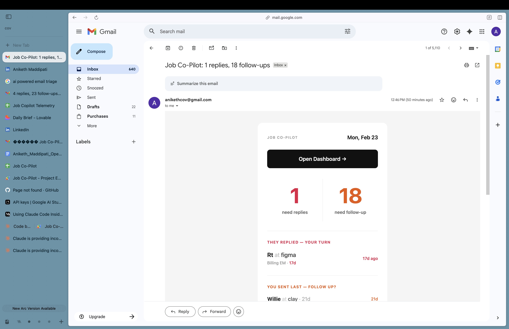

# Job Co-Pilot


An AI-powered job search tracker that lives in Google Sheets.

Scans your sent emails. Finds job threads. Tells you who to reply to.



---
For the full story, see [I Built This Because Job Searching Broke Me](https://medium.com/@anikethmaddipati/i-built-this-because-job-searching-broke-me-and-maybe-itll-help-you-too-74ca73305da8).

## The Problem

You're job searching. 40+ email threads. Some recruiters replied and you forgot. Some you followed up on twice. Some are dead but you keep checking.

Spreadsheet trackers require manual entry. You stop updating them after 3 days.

## What This Does

- **Syncs automatically** — Pulls your last 50 sent emails daily at 6am
- **AI classification** — Figures out which are job-related
- **Shows what matters** — Who needs a reply, who to follow up with
- **Daily digest** — 7am email with your top plays

---

## Get Started (5 minutes)

1. [**Copy the template**](https://docs.google.com/spreadsheets/d/1UmN1oQtpoHZ8s6A9alow-NZN2SZiXmF89LQiHR4MnRE/copy)
2. Get a free API key from [Groq](https://console.groq.com/keys) or [Gemini](https://aistudio.google.com/app/apikey)
3. Open the sheet → **📧 Job Co-Pilot → Setup** → Paste key → Initialize

---

## Privacy

Your data stays yours.

- Runs entirely in your Google account
- AI only sees thread metadata (subject, contact, days)
- No external servers
- Open source — read every line

---

## Limitations

- **Thread links in digest don't work** — Gmail uses a different ID format. Use the dashboard.
- **AI isn't perfect** — Some threads get miscategorized. Use "Sync (Fresh)" to re-run.

---

## Architecture

```
User's Google Account
├── Gmail (sent folder) ──▶ Apps Script ──▶ Google Sheet
└── Triggers (6am sync, 7am digest)
                              │
                              ▼
                         LLM APIs (Groq → Gemini)
```

See [ARCHITECTURE.md](ARCHITECTURE.md) for details.

---

## Status

Code is available to use, fork, learn from.

I'm job searching — can't commit to full open source contribution model yet. Feedback welcome, updates when I can.

---

## Author

**Aniketh Maddipati** — Engineering leader, NYC

[LinkedIn](https://linkedin.com/in/anikethmaddipati) · [GitHub](https://github.com/aniketh-maddipati)

---

MIT License
